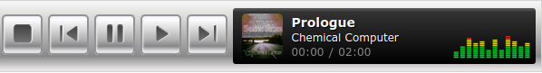
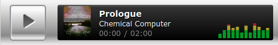

# Myspace Music Player Extended

This project is [a fork of an earlier attempt](https://github.com/rodrmig/myspace-music-player)
to recreate the classic Myspace Music Player in HTML5.
It's a piece of nostalgic beauty, and I wanted to see what could be done to
better recreate the visual style while using a more robust solution for audio.



The player has been adapted to use AmplitudeJS, which cleans up a lot of the
playback handling and adds a lot of features that this thing could be built upon.



This music player is a clone from the popular social network "Myspace" from the mid 2000's.

The songs included for the player examples are also made by me,
licensed under CC-BY-SA 4.0 International.

#TODO
There's a few features still missing on this project, but I'm really happy with
where it's at. Here's what still needs to be done for the project to feel complete:

* Visual Playlist support for the "Band Page" version of the widget
* A working visualizer. The image is just a placeholder.

The first one is "probably easy", just will take some time to build,
the second one is "probably hard", because I understand very little about
Web Audio APIs and visualization frameworks right now.

## Installation

Clone this repository to your machine.

```bash
git clone https://codeberg.org/deadsuperhero/myspace-music-player-extended
```

## Usage
Open `index.html` for a live demo. See the following code snippet from `js/app.js` for setup.

```javascript
Amplitude.init({
"bindings": {
  37: 'prev',
  39: 'next',
  32: 'play_pause'
},
"songs": [
  {
    "name": "Feel Good",
    "artist": "Syn Cole",
    "album": "We Are to Answer",
    "url": "audio/Syn_Cole-Feel_Good.mp3",
    "cover_art_url": "img/album.jpg"
  }
]
});

window.onkeydown = function(e) {
  return !(e.keyCode == 32);
};

/*
Handles a click on the song played progress bar.
*/
document.getElementById('button.play').addEventListener('click', function( e ){
var offset = this.getBoundingClientRect();
var x = e.pageX - offset.left;

Amplitude.setSongPlayedPercentage( ( parseFloat( x ) / parseFloat( this.offsetWidth) ) * 100 );
});
```

## License
[MIT](https://choosealicense.com/licenses/mit/)
